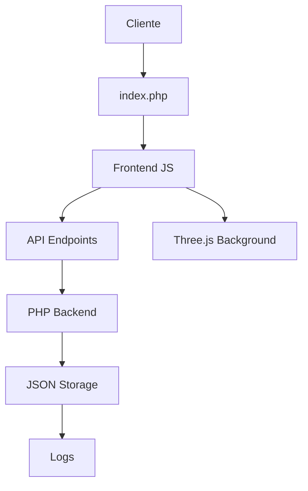

# 🛡️ IP Checker - Sistema de Verificación Avanzado

> **Sistema profesional de gestión y verificación de direcciones IP con arquitectura moderna, interfaz elegante y funcionalidades empresariales.**

[](https://php.net)
[](LICENSE)
[](https://github.com/your-repo/ip-checker-pro)

## 📋 Tabla de Contenidos

- [Descripción General](#-descripción-general)
- [Características Técnicas](#-características-técnicas)
- [Arquitectura del Sistema](#-arquitectura-del-sistema)
- [Instalación y Configuración](#-instalación-y-configuración)
- [Documentación de API](#-documentación-de-api)
- [Guía de Desarrollo](#-guía-de-desarrollo)
- [Seguridad y Auditoría](#-seguridad-y-auditoría)
- [Performance y Optimización](#-performance-y-optimización)
- [Troubleshooting](#-troubleshooting)

## 🎯 Descripción General

**IP Checker** es una solución empresarial completa para la gestión, verificación y auditoría de direcciones IP. Diseñado con arquitectura moderna y tecnologías de vanguardia, proporciona una interfaz intuitiva para administradores de sistemas y profesionales de seguridad.

### 🎨 Características de Diseño

#### Paleta de Colores Profesional
```css
/* Variables CSS principales */
--primary: #2563eb;      /* Azul corporativo */
--primary-dark: #1d4ed8; /* Azul oscuro */
--primary-light: #3b82f6; /* Azul claro */
--success: #10b981;      /* Verde de éxito */
--warning: #f59e0b;      /* Naranja de advertencia */
--danger: #ef4444;       /* Rojo de error */
--info: #06b6d4;         /* Cian informativo */
```

#### Tipografía y UX
- **Inter**: Tipografía principal para UI/UX
- **JetBrains Mono**: Para datos técnicos y código
- **Font Awesome 6.4.0**: Iconografía profesional
- **Responsive Design**: Mobile-first approach

## 🔧 Características Técnicas

### Frontend Stack
```javascript
// Tecnologías principales
- HTML5 (Semántico y accesible)
- CSS3 (Variables, Grid, Flexbox, Animaciones)
- JavaScript ES6+ (Módulos, Async/Await, Fetch API)
- Three.js r134 (Efectos 3D y animaciones)
- Web APIs (Notifications, Clipboard, Intersection Observer)
```

### Backend Stack
```php
// Tecnologías del servidor
- PHP 7.4+ (Tipado estricto, Arrow functions)
- JSON (Almacenamiento de datos)
- RESTful APIs (CRUD completo)
- CORS (Cross-Origin Resource Sharing)
- Error Handling (Try-catch, logging)
```

### APIs Externas
```javascript
// Servicios de terceros
- ipify.org (Detección de IP pública)
- ip-api.com (Geolocalización)
- Google Fonts (Tipografía)
- CDN (Font Awesome, Three.js)
```

## 🏗️ Arquitectura del Sistema

### Estructura de Directorios
```
ip-check/
├── 📁 assets/
│   ├── 📁 css/
│   │   └── style.css              # Estilos principales (CSS3)
│   ├── 📁 js/
│   │   ├── app.js                 # Lógica de aplicación
│   │   ├── ui.js                  # Componentes de UI
│   │   └── background.js          # Efectos Three.js
│   └── 📁 php/
│       ├── verify_ip.php          # Verificación de IPs
│       ├── get_config.php         # Obtener configuración
│       ├── save_config.php        # Guardar configuración
│       ├── get_ips.php           # Obtener IPs autorizadas
│       ├── add_ip.php            # Agregar IP
│       ├── remove_ip.php         # Eliminar IP
│       └── log_access.php        # Sistema de logs
├── 📁 config/
│   ├── system_config.json        # Configuración del sistema
│   └── authorized_ips.json       # Lista de IPs autorizadas
├── 📁 logs/
│   └── access_log.json           # Logs de auditoría
├── index.php                     # Punto de entrada principal
└── README.md                     # Documentación
```

### Flujo de Datos


## 🚀 Instalación y Configuración

### Requisitos del Sistema

#### Servidor Web
```bash
# Apache/Nginx con módulos
- mod_rewrite (Apache)
- PHP 7.4+ con extensiones:
  - json
  - filter
  - curl
  - fileinfo
```

#### Cliente
```javascript
// Navegador moderno con soporte para:
- ES6+ (Arrow functions, destructuring)
- Fetch API
- WebGL (Three.js)
- CSS Grid/Flexbox
- Intersection Observer API
```

### Instalación Paso a Paso

#### 1. Preparación del Entorno
```bash
# Clonar repositorio
git clone https://github.com/your-repo/ip-checker-pro.git
cd ip-checker-pro

# Configurar permisos (Linux/macOS)
chmod 755 config/ logs/
chmod 644 config/*.json logs/*.json
```

#### 2. Configuración del Servidor
```apache
# .htaccess para Apache
RewriteEngine On
RewriteCond %{REQUEST_FILENAME} !-f
RewriteCond %{REQUEST_FILENAME} !-d
RewriteRule ^(.*)$ index.php [QSA,L]

# Headers de seguridad
Header always set X-Content-Type-Options nosniff
Header always set X-Frame-Options DENY
Header always set X-XSS-Protection "1; mode=block"
```

#### 3. Configuración de PHP
```ini
; php.ini recomendado
display_errors = Off
log_errors = On
error_log = /path/to/error.log
max_execution_time = 30
memory_limit = 128M
post_max_size = 8M
upload_max_filesize = 2M
```

#### 4. Verificación de Instalación
```bash
# Comprobar estructura
ls -la config/
ls -la logs/
ls -la assets/php/

# Verificar permisos
stat config/system_config.json
stat logs/access_log.json
```

## 📚 Documentación de API

### Endpoints Principales

#### Verificación de IP
```http
POST /assets/php/verify_ip.php
Content-Type: application/json

{
  "ip": "192.168.1.1"
}
```

**Respuesta:**
```json
{
  "success": true,
  "message": "IP 192.168.1.1 autorizada en lista blanca",
  "status": "allowed"
}
```

#### Gestión de Configuración
```http
GET /assets/php/get_config.php
POST /assets/php/save_config.php
Content-Type: application/json

{
  "accessMode": "whitelist",
  "logAttempts": true,
  "notifications": true,
  "autoRefresh": true
}
```

#### Gestión de IPs
```http
GET /assets/php/get_ips.php
POST /assets/php/add_ip.php
POST /assets/php/remove_ip.php
Content-Type: application/json

{
  "ip": "192.168.1.100"
}
```

### Códigos de Estado HTTP
```http
200 OK           # Operación exitosa
400 Bad Request  # Datos inválidos
403 Forbidden    # Acceso denegado
404 Not Found    # Recurso no encontrado
500 Server Error # Error interno
```

## 💻 Guía de Desarrollo

### Estructura de Código

#### Frontend (JavaScript)
```javascript
// app.js - Lógica principal
class IPCheckerApp {
    constructor() {
        this.state = {
            currentIP: null,
            authorizedIPs: [],
            systemConfig: {}
        };
    }
    
    async checkCurrentIP() {
        // Implementación de verificación
    }
    
    async loadAuthorizedIPs() {
        // Carga de IPs autorizadas
    }
}

// ui.js - Componentes de UI
class UIManager {
    showNotification(message, type) {
        // Sistema de notificaciones
    }
    
    setupEventListeners() {
        // Event listeners
    }
}
```

#### Backend (PHP)
```php
// verify_ip.php - Verificación de IPs
class IPVerifier {
    private function isValidIP($ip) {
        return filter_var($ip, FILTER_VALIDATE_IP) !== false;
    }
    
    private function loadAuthorizedIPs() {
        $ipsFile = '../../config/authorized_ips.json';
        return json_decode(file_get_contents($ipsFile), true) ?: [];
    }
    
    public function verifyIP($ip) {
        // Lógica de verificación
    }
}
```

### Patrones de Diseño

#### Singleton para Configuración
```php
class ConfigManager {
    private static $instance = null;
    private $config = [];
    
    public static function getInstance() {
        if (self::$instance === null) {
            self::$instance = new self();
        }
        return self::$instance;
    }
}
```

#### Observer para Notificaciones
```javascript
class NotificationObserver {
    constructor() {
        this.observers = [];
    }
    
    subscribe(callback) {
        this.observers.push(callback);
    }
    
    notify(message, type) {
        this.observers.forEach(observer => observer(message, type));
    }
}
```

### Testing

#### Tests Unitarios (PHP)
```php
// tests/verify_ip_test.php
class IPVerifierTest extends PHPUnit\Framework\TestCase {
    public function testValidIP() {
        $verifier = new IPVerifier();
        $result = $verifier->verifyIP('192.168.1.1');
        $this->assertTrue($result['success']);
    }
}
```

#### Tests de Integración (JavaScript)
```javascript
// tests/app.test.js
describe('IP Checker App', () => {
    test('should verify IP correctly', async () => {
        const app = new IPCheckerApp();
        const result = await app.verifyIP('192.168.1.1');
        expect(result.success).toBe(true);
    });
});
```

## 🔒 Seguridad y Auditoría

### Validación de Entrada
```php
// Sanitización de datos
function sanitizeInput($data) {
    return htmlspecialchars(strip_tags(trim($data)));
}

// Validación de IP
function validateIP($ip) {
    return filter_var($ip, FILTER_VALIDATE_IP) !== false;
}
```

### Headers de Seguridad
```php
// Headers de seguridad
header('X-Content-Type-Options: nosniff');
header('X-Frame-Options: DENY');
header('X-XSS-Protection: 1; mode=block');
header('Referrer-Policy: strict-origin-when-cross-origin');
```

### Sistema de Logs
```php
// Logging estructurado
function logAccess($ip, $status, $message) {
    $logEntry = [
        'ip' => $ip,
        'status' => $status,
        'message' => $message,
        'timestamp' => date('Y-m-d H:i:s'),
        'user_agent' => $_SERVER['HTTP_USER_AGENT'] ?? 'Unknown',
        'remote_ip' => $_SERVER['REMOTE_ADDR'] ?? 'Unknown'
    ];
    
    // Guardar en JSON para auditoría
    saveLogEntry($logEntry);
}
```

### Auditoría de Seguridad
```bash
# Comandos de auditoría
# Verificar logs de acceso
tail -f logs/access_log.json | jq '.[0:10]'

# Analizar intentos de acceso
grep "denied" logs/access_log.json | wc -l

# Verificar IPs sospechosas
jq '.[] | select(.status == "denied") | .ip' logs/access_log.json | sort | uniq -c
```

## ⚡ Performance y Optimización

### Optimizaciones Frontend
```javascript
// Lazy loading de componentes
const loadComponent = async (componentName) => {
    const module = await import(`./components/${componentName}.js`);
    return module.default;
};

// Debouncing para búsquedas
const debounce = (func, delay) => {
    let timeoutId;
    return (...args) => {
        clearTimeout(timeoutId);
        timeoutId = setTimeout(() => func.apply(null, args), delay);
    };
};

// Throttling para eventos de scroll
const throttle = (func, limit) => {
    let inThrottle;
    return function() {
        const args = arguments;
        const context = this;
        if (!inThrottle) {
            func.apply(context, args);
            inThrottle = true;
            setTimeout(() => inThrottle = false, limit);
        }
    };
};
```

### Optimizaciones Backend
```php
// Caching de configuración
class ConfigCache {
    private static $cache = [];
    private static $cacheTime = 300; // 5 minutos
    
    public static function get($key) {
        if (isset(self::$cache[$key]) && 
            (time() - self::$cache[$key]['time']) < self::$cacheTime) {
            return self::$cache[$key]['data'];
        }
        return null;
    }
    
    public static function set($key, $data) {
        self::$cache[$key] = [
            'data' => $data,
            'time' => time()
        ];
    }
}
```

### Métricas de Performance
```javascript
// Métricas de rendimiento
class PerformanceMonitor {
    constructor() {
        this.metrics = {
            loadTime: 0,
            apiCalls: 0,
            errors: 0
        };
    }
    
    measureLoadTime() {
        const start = performance.now();
        return () => {
            this.metrics.loadTime = performance.now() - start;
        };
    }
    
    logAPICall(endpoint) {
        this.metrics.apiCalls++;
        console.log(`API Call: ${endpoint}`);
    }
}
```

## 🐛 Troubleshooting

### Problemas Comunes

#### Error: "No se puede obtener IP pública"
```bash
# Verificar conectividad
curl -I https://api.ipify.org
ping api.ipify.org

# Verificar configuración de red
nslookup api.ipify.org
traceroute api.ipify.org
```

#### Error: "Permisos denegados"
```bash
# Verificar permisos de archivos
ls -la config/
ls -la logs/

# Corregir permisos
chmod 755 config/ logs/
chmod 644 config/*.json logs/*.json
chown www-data:www-data config/ logs/
```

#### Error: "JSON inválido"
```bash
# Validar archivos JSON
jq . config/system_config.json
jq . config/authorized_ips.json
jq . logs/access_log.json

# Reparar JSON corrupto
echo '[]' > logs/access_log.json
echo '{}' > config/system_config.json
```

### Logs de Debug
```php
// Habilitar debug
error_reporting(E_ALL);
ini_set('display_errors', 1);
ini_set('log_errors', 1);
ini_set('error_log', '/path/to/debug.log');

// Logging detallado
function debugLog($message, $data = null) {
    $logEntry = [
        'timestamp' => date('Y-m-d H:i:s'),
        'message' => $message,
        'data' => $data,
        'trace' => debug_backtrace(DEBUG_BACKTRACE_IGNORE_ARGS, 2)
    ];
    
    error_log(json_encode($logEntry));
}
```

### Monitoreo del Sistema
```bash
# Script de monitoreo
#!/bin/bash
# monitor.sh

echo "=== IP Checker Pro - System Monitor ==="
echo "Date: $(date)"
echo ""

# Verificar servicios
echo "1. Checking PHP..."
php -v
echo ""

# Verificar archivos críticos
echo "2. Checking critical files..."
ls -la config/
ls -la logs/
echo ""

# Verificar logs recientes
echo "3. Recent logs..."
tail -5 logs/access_log.json | jq .
echo ""

# Verificar espacio en disco
echo "4. Disk usage..."
df -h .
echo ""
```

## 📄 Licencia

Este proyecto está bajo la **Licencia MIT**. Ver archivo `LICENSE` para más detalles.

```text
MIT License

Copyright (c) 2025 IP Checker

Permission is hereby granted, free of charge, to any person obtaining a copy
of this software and associated documentation files (the "Software"), to deal
in the Software without restriction, including without limitation the rights
to use, copy, modify, merge, publish, distribute, sublicense, and/or sell
copies of the Software, and to permit persons to whom the Software is
furnished to do so, subject to the following conditions:

The above copyright notice and this permission notice shall be included in all
copies or substantial portions of the Software.
```

## 🤝 Contribuciones

### Guía de Contribución
1. **Fork** el repositorio
2. **Crear** una rama para tu feature (`git checkout -b feature/AmazingFeature`)
3. **Commit** tus cambios (`git commit -m 'Add some AmazingFeature'`)
4. **Push** a la rama (`git push origin feature/AmazingFeature`)
5. **Abrir** un Pull Request

### Estándares de Código
```javascript
// JavaScript - ESLint config
{
  "extends": ["eslint:recommended"],
  "rules": {
    "indent": ["error", 2],
    "quotes": ["error", "single"],
    "semi": ["error", "always"]
  }
}
```

```php
// PHP - PSR-12
<?php

declare(strict_types=1);

namespace IPCheckerPro;

class ExampleClass
{
    public function exampleMethod(): void
    {
        // Implementation
    }
}
```
---

**IP Checker** - Sistema empresarial de verificación y gestión de IPs con arquitectura moderna y funcionalidades avanzadas.

*Desarrollado con ❤️ por el equipo de CyberCode Labs* 