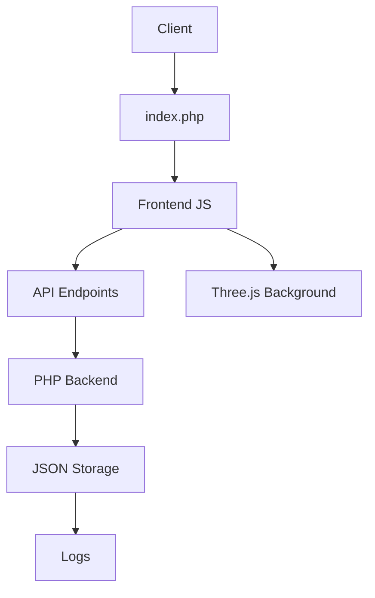

# 🛡️ IP Checker - Advanced Verification System

> **Professional IP address management and verification system with modern architecture, elegant interface and enterprise features.**

[](https://php.net)
[](LICENSE)
[](https://github.com/your-repo/ip-checker-pro)

## 📋 Table of Contents

- [General Description](#-general-description)
- [Technical Features](#-technical-features)
- [System Architecture](#-system-architecture)
- [Installation and Configuration](#-installation-and-configuration)
- [API Documentation](#-api-documentation)
- [Development Guide](#-development-guide)
- [Security and Auditing](#-security-and-auditing)
- [Performance and Optimization](#-performance-and-optimization)
- [Troubleshooting](#-troubleshooting)

## 🎯 General Description

**IP Checker** is a complete enterprise solution for IP address management, verification and auditing. Designed with modern architecture and cutting-edge technologies, it provides an intuitive interface for system administrators and security professionals.

### 🎨 Design Features

#### Professional Color Palette
```css
/* Main CSS variables */
--primary: #2563eb;      /* Corporate blue */
--primary-dark: #1d4ed8; /* Dark blue */
--primary-light: #3b82f6; /* Light blue */
--success: #10b981;      /* Success green */
--warning: #f59e0b;      /* Warning orange */
--danger: #ef4444;       /* Error red */
--info: #06b6d4;         /* Informative cyan */
```

#### Typography and UX
- **Inter**: Main typography for UI/UX
- **JetBrains Mono**: For technical data and code
- **Font Awesome 6.4.0**: Professional iconography
- **Responsive Design**: Mobile-first approach

## 🔧 Technical Features

### Frontend Stack
```javascript
// Main technologies
- HTML5 (Semantic and accessible)
- CSS3 (Variables, Grid, Flexbox, Animations)
- JavaScript ES6+ (Modules, Async/Await, Fetch API)
- Three.js r134 (3D effects and animations)
- Web APIs (Notifications, Clipboard, Intersection Observer)
```

### Backend Stack
```php
// Server technologies
- PHP 7.4+ (Strict typing, Arrow functions)
- JSON (Data storage)
- RESTful APIs (Complete CRUD)
- CORS (Cross-Origin Resource Sharing)
- Error Handling (Try-catch, logging)
```

### External APIs
```javascript
// Third-party services
- ipify.org (Public IP detection)
- ip-api.com (Geolocation)
- Google Fonts (Typography)
- CDN (Font Awesome, Three.js)
```

## 🏗️ System Architecture

### Directory Structure
```
ip-check/
├── 📁 assets/
│   ├── 📁 css/
│   │   └── style.css              # Main styles (CSS3)
│   ├── 📁 js/
│   │   ├── app.js                 # Application logic
│   │   ├── ui.js                  # UI components
│   │   └── background.js          # Three.js effects
│   └── 📁 php/
│       ├── verify_ip.php          # IP verification
│       ├── get_config.php         # Get configuration
│       ├── save_config.php        # Save configuration
│       ├── get_ips.php           # Get authorized IPs
│       ├── add_ip.php            # Add IP
│       ├── remove_ip.php         # Remove IP
│       └── log_access.php        # Logging system
├── 📁 config/
│   ├── system_config.json        # System configuration
│   └── authorized_ips.json       # Authorized IPs list
├── 📁 logs/
│   └── access_log.json           # Audit logs
├── index.php                     # Main entry point
└── README.md                     # Documentation
```

### Data Flow


## 🚀 Installation and Configuration

### System Requirements

#### Web Server
```bash
# Apache/Nginx with modules
- mod_rewrite (Apache)
- PHP 7.4+ with extensions:
  - json
  - filter
  - curl
  - fileinfo
```

#### Client
```javascript
// Modern browser with support for:
- ES6+ (Arrow functions, destructuring)
- Fetch API
- WebGL (Three.js)
- CSS Grid/Flexbox
- Intersection Observer API
```

### Step-by-Step Installation

#### 1. Environment Preparation
```bash
# Clone repository
git clone https://github.com/your-repo/ip-checker-pro.git
cd ip-checker-pro

# Configure permissions (Linux/macOS)
chmod 755 config/ logs/
chmod 644 config/*.json logs/*.json
```

#### 2. Server Configuration
```apache
# .htaccess for Apache
RewriteEngine On
RewriteCond %{REQUEST_FILENAME} !-f
RewriteCond %{REQUEST_FILENAME} !-d
RewriteRule ^(.*)$ index.php [QSA,L]

# Security headers
Header always set X-Content-Type-Options nosniff
Header always set X-Frame-Options DENY
Header always set X-XSS-Protection "1; mode=block"
```

#### 3. PHP Configuration
```ini
; Recommended php.ini
display_errors = Off
log_errors = On
error_log = /path/to/error.log
max_execution_time = 30
memory_limit = 128M
post_max_size = 8M
upload_max_filesize = 2M
```

#### 4. Installation Verification
```bash
# Check structure
ls -la config/
ls -la logs/
ls -la assets/php/

# Verify permissions
stat config/system_config.json
stat logs/access_log.json
```

## 📚 API Documentation

### Main Endpoints

#### IP Verification
```http
POST /assets/php/verify_ip.php
Content-Type: application/json

{
  "ip": "192.168.1.1"
}
```

**Response:**
```json
{
  "success": true,
  "message": "IP 192.168.1.1 authorized in whitelist",
  "status": "allowed"
}
```

#### Configuration Management
```http
GET /assets/php/get_config.php
POST /assets/php/save_config.php
Content-Type: application/json

{
  "accessMode": "whitelist",
  "logAttempts": true,
  "notifications": true,
  "autoRefresh": true
}
```

#### IP Management
```http
GET /assets/php/get_ips.php
POST /assets/php/add_ip.php
POST /assets/php/remove_ip.php
Content-Type: application/json

{
  "ip": "192.168.1.100"
}
```

### HTTP Status Codes
```http
200 OK           # Successful operation
400 Bad Request  # Invalid data
403 Forbidden    # Access denied
404 Not Found    # Resource not found
500 Server Error # Internal error
```

## 💻 Development Guide

### Code Structure

#### Frontend (JavaScript)
```javascript
// app.js - Main logic
class IPCheckerApp {
    constructor() {
        this.state = {
            currentIP: null,
            authorizedIPs: [],
            systemConfig: {}
        };
    }
    
    async checkCurrentIP() {
        // IP verification implementation
    }
    
    async loadAuthorizedIPs() {
        // Load authorized IPs
    }
}

// ui.js - UI components
class UIManager {
    showNotification(message, type) {
        // Notification system
    }
    
    setupEventListeners() {
        // Event listeners
    }
}
```

#### Backend (PHP)
```php
// verify_ip.php - IP verification
class IPVerifier {
    private function isValidIP($ip) {
        return filter_var($ip, FILTER_VALIDATE_IP) !== false;
    }
    
    private function loadAuthorizedIPs() {
        $ipsFile = '../../config/authorized_ips.json';
        return json_decode(file_get_contents($ipsFile), true) ?: [];
    }
    
    public function verifyIP($ip) {
        // Verification logic
    }
}
```

### Design Patterns

#### Singleton for Configuration
```php
class ConfigManager {
    private static $instance = null;
    private $config = [];
    
    public static function getInstance() {
        if (self::$instance === null) {
            self::$instance = new self();
        }
        return self::$instance;
    }
}
```

#### Observer for Notifications
```javascript
class NotificationObserver {
    constructor() {
        this.observers = [];
    }
    
    subscribe(callback) {
        this.observers.push(callback);
    }
    
    notify(message, type) {
        this.observers.forEach(observer => observer(message, type));
    }
}
```

### Testing

#### Unit Tests (PHP)
```php
// tests/verify_ip_test.php
class IPVerifierTest extends PHPUnit\Framework\TestCase {
    public function testValidIP() {
        $verifier = new IPVerifier();
        $result = $verifier->verifyIP('192.168.1.1');
        $this->assertTrue($result['success']);
    }
}
```

#### Integration Tests (JavaScript)
```javascript
// tests/app.test.js
describe('IP Checker App', () => {
    test('should verify IP correctly', async () => {
        const app = new IPCheckerApp();
        const result = await app.verifyIP('192.168.1.1');
        expect(result.success).toBe(true);
    });
});
```

## 🔒 Security and Auditing

### Input Validation
```php
// Data sanitization
function sanitizeInput($data) {
    return htmlspecialchars(strip_tags(trim($data)));
}

// IP validation
function validateIP($ip) {
    return filter_var($ip, FILTER_VALIDATE_IP) !== false;
}
```

### Security Headers
```php
// Security headers
header('X-Content-Type-Options: nosniff');
header('X-Frame-Options: DENY');
header('X-XSS-Protection: 1; mode=block');
header('Referrer-Policy: strict-origin-when-cross-origin');
```

### Logging System
```php
// Structured logging
function logAccess($ip, $status, $message) {
    $logEntry = [
        'ip' => $ip,
        'status' => $status,
        'message' => $message,
        'timestamp' => date('Y-m-d H:i:s'),
        'user_agent' => $_SERVER['HTTP_USER_AGENT'] ?? 'Unknown',
        'remote_ip' => $_SERVER['REMOTE_ADDR'] ?? 'Unknown'
    ];
    
    // Save to JSON for auditing
    saveLogEntry($logEntry);
}
```

### Security Auditing
```bash
# Audit commands
# Check access logs
tail -f logs/access_log.json | jq '.[0:10]'

# Analyze access attempts
grep "denied" logs/access_log.json | wc -l

# Check suspicious IPs
jq '.[] | select(.status == "denied") | .ip' logs/access_log.json | sort | uniq -c
```

## ⚡ Performance and Optimization

### Frontend Optimizations
```javascript
// Lazy loading of components
const loadComponent = async (componentName) => {
    const module = await import(`./components/${componentName}.js`);
    return module.default;
};

// Debouncing for searches
const debounce = (func, delay) => {
    let timeoutId;
    return (...args) => {
        clearTimeout(timeoutId);
        timeoutId = setTimeout(() => func.apply(null, args), delay);
    };
};

// Throttling for scroll events
const throttle = (func, limit) => {
    let inThrottle;
    return function() {
        const args = arguments;
        const context = this;
        if (!inThrottle) {
            func.apply(context, args);
            inThrottle = true;
            setTimeout(() => inThrottle = false, limit);
        }
    };
};
```

### Backend Optimizations
```php
// Configuration caching
class ConfigCache {
    private static $cache = [];
    private static $cacheTime = 300; // 5 minutes
    
    public static function get($key) {
        if (isset(self::$cache[$key]) && 
            (time() - self::$cache[$key]['time']) < self::$cacheTime) {
            return self::$cache[$key]['data'];
        }
        return null;
    }
    
    public static function set($key, $data) {
        self::$cache[$key] = [
            'data' => $data,
            'time' => time()
        ];
    }
}
```

### Performance Metrics
```javascript
// Performance metrics
class PerformanceMonitor {
    constructor() {
        this.metrics = {
            loadTime: 0,
            apiCalls: 0,
            errors: 0
        };
    }
    
    measureLoadTime() {
        const start = performance.now();
        return () => {
            this.metrics.loadTime = performance.now() - start;
        };
    }
    
    logAPICall(endpoint) {
        this.metrics.apiCalls++;
        console.log(`API Call: ${endpoint}`);
    }
}
```

## 🐛 Troubleshooting

### Common Issues

#### Error: "Cannot get public IP"
```bash
# Check connectivity
curl -I https://api.ipify.org
ping api.ipify.org

# Check network configuration
nslookup api.ipify.org
traceroute api.ipify.org
```

#### Error: "Permission denied"
```bash
# Check file permissions
ls -la config/
ls -la logs/

# Fix permissions
chmod 755 config/ logs/
chmod 644 config/*.json logs/*.json
chown www-data:www-data config/ logs/
```

#### Error: "Invalid JSON"
```bash
# Validate JSON files
jq . config/system_config.json
jq . config/authorized_ips.json
jq . logs/access_log.json

# Repair corrupted JSON
echo '[]' > logs/access_log.json
echo '{}' > config/system_config.json
```

### Debug Logs
```php
// Enable debug
error_reporting(E_ALL);
ini_set('display_errors', 1);
ini_set('log_errors', 1);
ini_set('error_log', '/path/to/debug.log');

// Detailed logging
function debugLog($message, $data = null) {
    $logEntry = [
        'timestamp' => date('Y-m-d H:i:s'),
        'message' => $message,
        'data' => $data,
        'trace' => debug_backtrace(DEBUG_BACKTRACE_IGNORE_ARGS, 2)
    ];
    
    error_log(json_encode($logEntry));
}
```

### System Monitoring
```bash
# Monitoring script
#!/bin/bash
# monitor.sh

echo "=== IP Checker Pro - System Monitor ==="
echo "Date: $(date)"
echo ""

# Check services
echo "1. Checking PHP..."
php -v
echo ""

# Check critical files
echo "2. Checking critical files..."
ls -la config/
ls -la logs/
echo ""

# Check recent logs
echo "3. Recent logs..."
tail -5 logs/access_log.json | jq .
echo ""

# Check disk usage
echo "4. Disk usage..."
df -h .
echo ""
```

## 📄 License

This project is under the **MIT License**. See `LICENSE` file for more details.

```text
MIT License

Copyright (c) 2025 IP Checker

Permission is hereby granted, free of charge, to any person obtaining a copy
of this software and associated documentation files (the "Software"), to deal
in the Software without restriction, including without limitation the rights
to use, copy, modify, merge, publish, distribute, sublicense, and/or sell
copies of the Software, and to permit persons to whom the Software is
furnished to do so, subject to the following conditions:

The above copyright notice and this permission notice shall be included in all
copies or substantial portions of the Software.
```

## 🤝 Contributions

### Contribution Guide
1. **Fork** the repository
2. **Create** a branch for your feature (`git checkout -b feature/AmazingFeature`)
3. **Commit** your changes (`git commit -m 'Add some AmazingFeature'`)
4. **Push** to the branch (`git push origin feature/AmazingFeature`)
5. **Open** a Pull Request

### Code Standards
```javascript
// JavaScript - ESLint config
{
  "extends": ["eslint:recommended"],
  "rules": {
    "indent": ["error", 2],
    "quotes": ["error", "single"],
    "semi": ["error", "always"]
  }
}
```

```php
// PHP - PSR-12
<?php

declare(strict_types=1);

namespace IPCheckerPro;

class ExampleClass
{
    public function exampleMethod(): void
    {
        // Implementation
    }
}
```

---

**IP Checker** - Enterprise IP verification and management system with modern architecture and advanced features.

*Developed with ❤️ by CyberCode Labs*

**Developer:** Yeremi Tantaraico  
**Company:** CyberCode Labs 